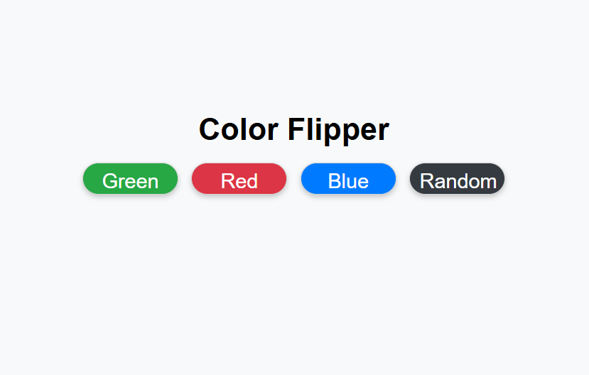

# Color Flipper

This project is a simple web application that allows users to change the background color of the page by clicking buttons or generating random colors.

## How to Use

1. Open the `index.html` file in your web browser.
2. Click on the color buttons to change the background color to predefined colors.
3. Click the "Random Color" button to generate a random background color.

## Files

- `index.html`: The main HTML file that contains the structure of the web page.
- `style.css`: The CSS file that styles the web page.
- `main.js`: The JavaScript file that contains the logic for changing colors.

## Screenshot

